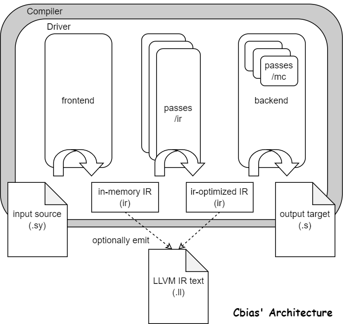

# CBIAS

Welcome to the official repo of Cbias! :D 

Cbias is the abbreviation of "a Compiler Built In A Semester", for commemorating the
time we, a three-member team spent together learning, coding and debugging in semester 2021-2022-2.

As a 2nd prize awarded work in [CSCC compiler contest](https://compiler.educg.net/) 2022, the compiler translates 
[SysY](doc/ref/SysY2022-lang-def.pdf) (a subset of C programming language) to ARM assembly code running on a Raspberry 
Pi 4 Model B 4GB. 

"A subset of C" is another reason for the project name "C Bias", with only partial features of C
are biased out to be supported.

This project is planned to serve as a teaching sample for BIT compiler
courses starting in 2023.

## Environment

IntelliJ is recommended as programming IDE for the project (not necessarily). To build and run
this source on your machine, configuration requirements are as follows.

### JDK 15+

We chose Java to program our compiler for portability provided by JVM.

The project is programmed following **JDK 15** rules. Thus, JDK 15+ is recommended.

### ANTLR 4.8+

ANTLRv4 is used for generating lexer and parser in our frontend. Thus, to build and run
the repo code, an antlr-runtime jar package is required to be manually downloaded and added
as a library of the source.

**Runtime version 4.8** is recommended, otherwise manual amendments on the generated code by ANTLR 
may be needed to inhibit version mismatch warnings/errors.

The runtime lib (e.g. antlr4-runtime-4.8.jar) can be placed under path 
[third-party/ANTLR](third-party/ANTLR). Lastest ANTLR runtime can be found [here](https://www.antlr.org/download.html).

## Usage

After build the project, run to translate any .sy source file (text SysY code) with command lines
below.

To compile source file `test/test.sy` to ARM assembly code, use argument `-S`. 
Use `-o` to specify an output path (e.g. `test/test.s`):
```
java Compiler test/test.sy -S -o test/test.s
```
IntelliJ will automatically configure lib or 
package references for you, remaining only class name ("Compiler") and extra arguments to be specified.

To dump the LLVM IR text code of the source file `test/test.sy`,
and store the output to `test/test.ll`, use argument `-emit-llvm`:
```
java Compiler test/test.sy -S -emit-llvm test/test.ll
```

During the development, we also build a tester project [CbiasTester](https://github.com/cabinz/cbias-tester) 
for batch testing on frontend and the whole pipeline respectively. 

## Project Structure

The partial skeleton of the project is as below: 
```
├─doc
├─src
│  ├─ir
│  ├─frontend
│  ├─backend
│  ├─passes
│  │  ├─ir
│  │  └─mc
│  └─utils
└─third-party
```
where the source majority code locate under `src`. `doc` stores references used in documentation. 
`third-party` contain 3rd-party services used by the project, e.g. ANTLR related modules.

All components work together as a complete pipeline translating a `.sy` source file into a `.s` assembly code file
as the figure below.



* `src/ir`: Definitions of the IR (intermediate representation) used in the project.
* `src/frontend`: Compiler frontend, conducting lexical, syntax analysis, translating source .sy code 
to in-memory IR.
* `src/backend`: Compiler backend, processing in-memory IR to generate correct assembly code.
* `src/passes`: Each separated reusable "pass" is a self-contained process on IR or MC
(lower-level ir in backend) conducting optimizing or translating. Various passes are registered to the 
compiling processes. To customize these passes, delve into PassManager for IR and MC respectively.
* `src/utils`: Common tool data structures.

Under the root dir of `src`, there are three classes:

* `src/Compiler.java`: The class directly run with commandline, resolving input source and user arguments for Driver.
* `src/Driver.java`: The driver control the concrete compiling flow.
* `src/CompileConfig.java`: Configuration info (commandline argument resolved) passing from Compiler to Driver.

